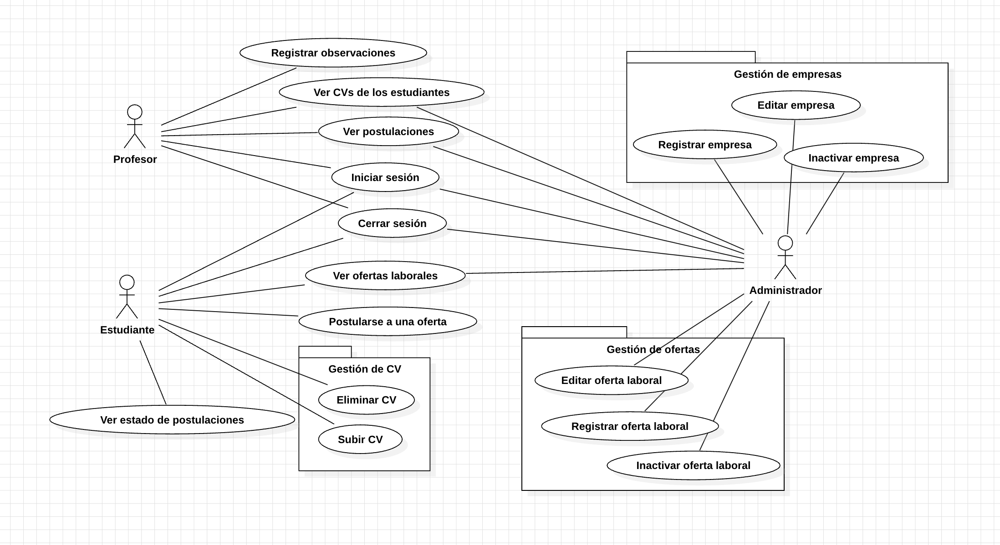
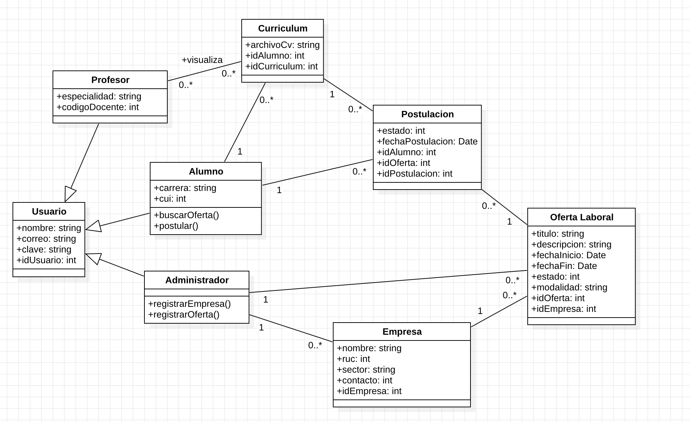
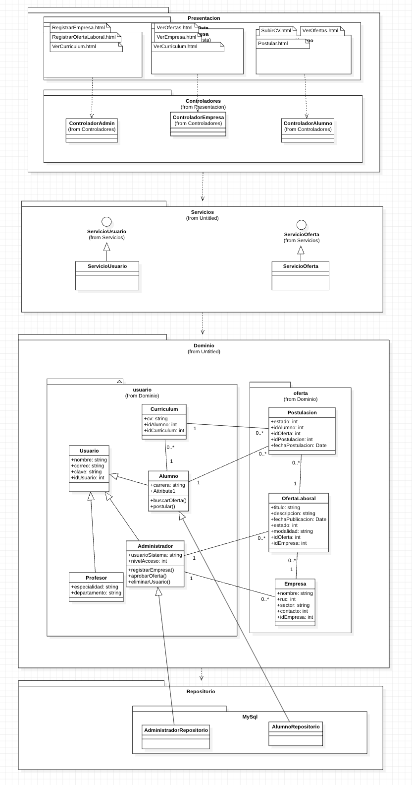
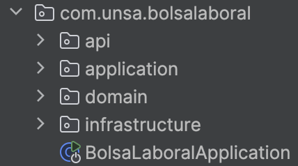

# Sistema de Bolsa Laboral - UNSA

## Propósito

Este sistema tiene como objetivo conectar a los **estudiantes de la UNSA** con **empresas** que ofrecen oportunidades laborales, a través de una plataforma digital donde los alumnos puedan:

- Subir y administrar su currículum (CV)
- Postularse a ofertas de empleo publicadas por empresas registradas
- Visualizar el estado de sus postulaciones
- Explorar ofertas laborales por filtros de carrera, modalidad, etc.

Además, el sistema permite que **administradores** gestionen empresas y ofertas laborales, y que **profesores** puedan visualizar los currículums de los estudiantes para brindarles apoyo o recomendación externa.

---

## Funcionalidades de Alto Nivel (Casos de Uso)

- 🎓 Alumno:
  - Buscar ofertas laborales
  - Postularse a una oferta laboral
  - Subir, ver y gestionar currículums
  - Ver historial de postulaciones

- 🧑‍🏫 Profesor:
  - Visualizar currículums de estudiantes

- 🧑‍💼 Administrador:
  - Registrar empresas
  - Registrar y administrar ofertas laborales
  - Ver reportes o estadísticas (opcional)

- 🏢 Empresa:
  - Publicar ofertas laborales (por medio del admin)

📌 **Diagrama de Casos de Uso UML:**  


---

## Prototipo / GUI (Interfaz de Usuario)

Se cuenta con un prototipo visual que muestra las pantallas principales del sistema:

- Vista alumno: listado de ofertas, formulario de postulación, carga de CV
- Vista administrador: formularios para registrar empresa y oferta
- Vista empresa (pasiva): vista de ofertas publicadas
- Vista profesor: explorador de CVs

📌 **Enlace del prototipo: https://www.canva.com/design/DAGpRL3kFGQ/8asF3UKgim2lbnSpreqgiQ/edit?utm_content=DAGpRL3kFGQ&utm_campaign=designshare&utm_medium=link2&utm_source=sharebutton **  

---

## Modelo de Dominio

### Diagrama de Clases

Incluye entidades como:
- Usuario (Alumno, Profesor, Administrador)
- Empresa
- OfertaLaboral
- Postulación
- Curriculum

📌 **Imagen del diagrama de clases UML:**  


---

### 🔸 Módulos del dominio (vista desde el negocio)

| Módulo | Responsabilidad |
|--------|------------------|
| Gestión de Usuarios | Registro, autenticación y roles |
| Gestión de Currículums | Subida, visualización y uso en postulaciones |
| Gestión de Empresas | Registro y visualización de empresas |
| Gestión de Ofertas | Publicación y consulta de ofertas laborales |
| Gestión de Postulaciones | Aplicación del alumno a ofertas |

---

## 🏗️ Vista General de Arquitectura

### 🔹 Diagrama de Paquetes

El sistema está dividido en capas según la arquitectura por capas:

- `presentacion`: vistas y controladores
- `servicios`: lógica de aplicación
- `dominio`: entidades de negocio
- `repositorio`: acceso a datos

📌 **Diagrama de Paquetes:**  


---

## Requisitos Técnicos

- Lenguaje: JAVA / SPRING BOOT / etc.
- Base de datos: PostgreSQL
- ORM: JPA
- Arquitectura: DDD + MVC + ORM


# Convenciones de codificación
### Mejora aplicada: Implementación del Patrón Builder en la clase `Empresa`

Durante el análisis del código implementado, **SonarQube** detectó un problema relacionado con el constructor de la clase `Empresa`, este consistía que contaba con **demasiados parámetros**:

> **SonarQube Warning:** Constructor has 8 parameters, which is greater than 7 authorized.

Según SonarQube esto afectaba la **legibilidad**, **mantenibilidad** y aumentaba el riesgo de errores por el orden de los argumentos.

---

### Solución implementada: Patrón de diseño Builder

Se aplicó el patrón **Builder** en la clase `Empresa` para construir objetos de manera **más legible y segura**, especialmente útil cuando se manejan muchos atributos.

#### Antes (problema detectado):

```java
public Empresa(UUID id, String ruc, String nombre, DatosContacto datosContacto,
               String descripcion, UUID empresaTipoId, LocalDateTime createdAt,
               LocalDateTime updatedAt, boolean activa) {
    this.id = id;
    this.ruc = ruc;
    this.nombre = nombre;
    this.datosContacto = datosContacto;
    this.descripcion = descripcion;
    this.empresaTipoId = empresaTipoId;
    this.createdAt = createdAt;
    this.updatedAt = updatedAt;
    this.activa = activa;
} 
```

#### Después (Uso del Patrón Builder):
```java
Empresa empresa = Empresa.builder()
    .id(UUID.randomUUID())
    .ruc("12345678901")
    .nombre("Incalpaca")
    .datosContacto(new DatosContacto("Av. Textiles 456", "987654321", "contacto@incalpaca.pe"))
    .descripcion("Empresa de textiles de alpaca")
    .empresaTipoId(UUID.fromString("00000000-0000-0000-0000-000000000000"))
    .createdAt(LocalDateTime.now())
    .updatedAt(LocalDateTime.now())
    .activa(true)
    .build();

```
# Estilos de Programación aplicadas
En el desarrollo del **CRUD de empresas** para el sistema de la Bolsa Laboral UNSA, se aplicaron ciertos estilos de programación para asegurar un diseño limpio, mantenible y escalable. Los estilos usados son los siguientes:

---

### 1. Cookbook
Cookbook se basa en la idea de recopilar y utilizar pequeños programas o fragmentos de código, "recetas", que demuestran la solución a un problema particular o la implementación de un concepto de programación específico.

Este estilo se refleja en la capa de servicios de aplicación, donde cada clase representa un caso de uso bien definido (registrar, editar, cambiar estado, listar, entre otros). Cada uno actúa como una "receta" con pasos claros para cumplir su propósito.

**Ejemplo:**

```java
public Empresa ejecutar(Empresa empresa) {
    empresa.setActiva(true);
    empresa.setCreatedAt(LocalDateTime.now());
    empresa.setUpdatedAt(LocalDateTime.now());
    return empresaRepository.guardar(empresa);
}
```

### 2. Error/Exception Handling
Error/Exception Handling se basa en la gestión robusta y controlada de situaciones inesperadas o anómalas que pueden ocurrir durante la ejecución de un programa. En lugar de permitir que un error detenga abruptamente el programa (lo que se conoce como "crash" o "fallo"), este estilo busca anticipar, detectar y responder a estas situaciones de una manera predefinida, permitiendo que el programa se recupere o termine de forma elegante.

Este estilo se implementó haciendo un manejo adecuado de errores utilizando Optional y respuestas HTTP con ResponseEntity para evitar excepciones no controladas y brindar respuestas más limpias al cliente.

**Ejemplo:**

```java
@PutMapping("/{id}")
public ResponseEntity<Empresa> editar(@PathVariable UUID id, @RequestBody Empresa empresa) {
    empresa.setId(id);
    Optional<Empresa> actualizada = editarEmpresaService.ejecutar(id, empresa);
    return actualizada
        .map(ResponseEntity::ok)
        .orElse(ResponseEntity.notFound().build());
}
```

### 3. Persistent-Tables

Persistent-Tables se basa en el concepto de utilizar estructuras de datos inmutables y persistentes, que se asemejan a tablas, para representar el estado de una aplicación.

Este estilo se implementó en el modelo Empresa que representa una entidad que se almacena en la base de datos mediante anotaciones de JPA. Se define con columnas específicas que reflejan su estructura persistente.

**Ejemplo:**

```java
@Entity
@Table(name = "empresas")
public class Empresa {
    @Id
    @GeneratedValue
    private UUID id;

    @Column(name = "ruc", nullable = false, unique = true)
    private String ruc;

    @Column(name = "nombre", nullable = false)
    private String nombre;
}
```

### 4. RESTful

RESTful se basa en un conjunto de principios arquitectónicos que guían el diseño de sistemas distribuidos, particularmente servicios web. Su objetivo principal es ofrecer una forma ligera, escalable y sin estado de comunicación entre diferentes componentes de software, comúnmente clientes y servidores.

Este estilo se adoptó para exponer los recursos de forma clara y estandarizada a través de endpoints HTTP semánticos, que siguen las convenciones de REST.

**Endpoints REST:**

| Método | Endpoint                    | Descripción                          |
|--------|-----------------------------|--------------------------------------|
| GET    | `/api/empresas`             | Listar todas las empresas            |
| GET    | `/api/empresas/{id}`        | Obtener una empresa por su ID        |
| POST   | `/api/empresas`             | Registrar una nueva empresa          |
| PUT    | `/api/empresas/{id}`        | Editar una empresa existente         |
| PUT    | `/api/empresas/{id}/estado` | Cambiar el estado activo/inactivo    |

# Clean Code
En el presente informe se describe las prácticas de codificación aplicadas en la implementación de los módulos del sistema. En este caso para la implementación del servicio o caso de uso **Registrar Observaciones** por parte del actor **profesor**.

### 1. Nombres
**Práctica:** Se usaron nombres descriptivos para las clases, variables y métodos, evitando abreviaciones confusas.

```java
private UUID id;
private String contenido;
private LocalDate fecha;
private Estudiante estudiante;
private Profesor profesor;
```

### 2. Funciones
**Práctica:** Las funciones tienen una sola responsabilidad. Se evita mezclar lógica de negocios con acceso a datos.

```java
@PostMapping("/observaciones")
public ResponseEntity<Observacion> registrarObservacion(@RequestBody Observacion observacion) {
    Observacion nuevaObservacion = registrarObservacionesService.ejecutar(observacion);
    return ResponseEntity.ok(nuevaObservacion);
}
```

### 3. Comentarios
**Práctica:** Comentarios solo cuando el código no es autoexplicativo.

```java
public Observacion ejecutar(Observacion observacion) {
    // Guardar una nueva observación con las relaciones establecidas
    return observacionRepository.guardar(observacion);
}
```
### 4. Estructura del Código Fuente
**Práctica:** Organización en paquetes por responsabilidades: controller, model, repository.



### 5. Objetos/Estructura de Datos
**Práctica:** Se utilizan relaciones bien definidas con **@ManyToOne**.

```java
@ManyToOne
@JoinColumn(name = "estudiante_id", nullable = false)
private Estudiante estudiante;

@ManyToOne
@JoinColumn(name = "profesor_id", nullable = false)
private Profesor profesor;
```

### 6. Tratamiento de Errores
**Práctica:** Se envolvió la lógica de registro de observaciones en un bloque try-catch para manejar posibles errores en tiempo de ejecución, como fallos de validación o errores de persistencia. Esto asegura que el servicio no colapse y se puedan enviar respuestas adecuadas.

```java
@PostMapping("/observaciones")
public ResponseEntity<?> registrarObservacion(@RequestBody Observacion observacion) {
    try {
        Observacion nuevaObservacion = registrarObservacionesService.ejecutar(observacion);
        return ResponseEntity.ok(nuevaObservacion);
    } catch (IllegalArgumentException e) {
        return ResponseEntity.badRequest().body("Datos inválidos: " + e.getMessage());
    } catch (Exception e) {
        return ResponseEntity.status(HttpStatus.INTERNAL_SERVER_ERROR)
            .body("Error inesperado: " + e.getMessage());
    }
}
```

### 7. Clases
**Práctica:** Cada clase representa una sola entidad/responsabilidad, con nombres claros y anotacioens JPA.

```java
@Entity
public class Observacion {
    @Id
    @GeneratedValue
    private UUID id;

    @ManyToOne(optional = false)
    @JoinColumn(name = "profesor_id")
    private Profesor profesor;

    @ManyToOne(optional = false)
    @JoinColumn(name = "estudiante_id")
    private Estudiante estudiante;

    @Column(nullable = false, length = 1000)
    private String contenido;

    @Column(nullable = false)
    private LocalDateTime fecha;
}
```

### Reporte de SonarLint
Se utilizó para identificar y corregir:
 - Variables sin uso
 - Errores de asignación nula
 - Malas prácticas en la definición de clases y métodos.

# Aplicación de Principios SOLID
En el presente informe se detallan los principios SOLID aplicados en el proyecto, acompañados de ejemplos concretos y explicaciones.

### S - Principio de Responsabilidad Única (SRP)

Cada clase debe tener una única responsabilidad y razón para cambiar. No debe mezclar lógica de negocio con lógica de control o persistencia.

```java
@Service
public class RegistrarObservacionesService {
private final ObservacionRepository observacionRepository;

    public RegistrarObservacionesService(ObservacionRepository observacionRepository) {
        this.observacionRepository = observacionRepository;
    }

    public Observacion ejecutar(Observacion observacion) {
        // Guardar una nueva observación con las relaciones establecidas
        return observacionRepository.guardar(observacion);
    }
}
```

### O - Principio de Abierto/Cerrado (OCP)
Las clases deben estar abiertas para extensión pero cerradas a modificación.

```java
public interface SpringDataObservacionRepository extends JpaRepository<Observacion, UUID> {
    // Puede extenderse con nuevos métodos sin modificar la clase existente
}
```

### D - Principio de Inversión de Dependencias (DIP)
Los módulos de alto nivel no deben depender de módulos de bajo nivel. Ambos deben depender de abstracciones (interfaces).

```java
@Service
public class RegistrarObservacionesService {
    private final ObservacionRepository observacionRepository;

    public RegistrarObservacionesService(ObservacionRepository observacionRepository) {
        this.observacionRepository = observacionRepository;
    }
}
```
